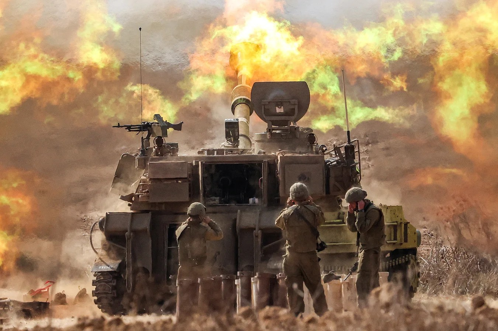
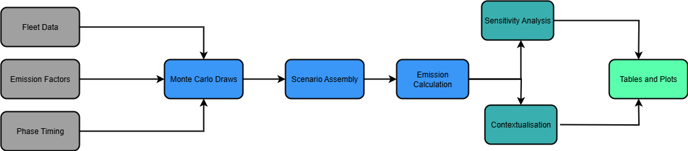

<h1 align="center"> Conflict CO₂ Impact Simulator
 </h1>

This repository quantifies CO₂ emissions from fuel use in armed conflict, using modular simulations of vehicle activity, logistics (tanker operations), temporal phasing, and Monte Carlo uncertainty.
</img>

## Table of Contents
- [Scope and Motivation](#scope-and-motivation)
- [Objectives](#objectives)
- [Repository Structure](#repository-structure)
- [Inputs](#input-data)
- [Methodology](#methodology)
- [Monte Carlo — Draw Construction](#monte-carlo--draw-construction)
- [Uncertainty Design & Rationale](#uncertainty-design--rationale)
- [Campaign Phases](#campaign-phases)
- [Outputs](#outputs)
- [Limitations](#limitations)
- [Future Extensions](#future-extensions)
- [References](#references)

## Scope and Motivation

Vehicle fuel use is one of the most consistently measurable and universally relevant sources of CO₂ emissions in armed conflicts. Unlike many other contributing factors—such as infrastructure destruction, land-use change, or displaced population flows—fuel consumption can be quantified using relatively standardised operational parameters (fleet size, fuel efficiency, activity levels) and well-documented emission factors. 

This makes it possible to model a range of scenarios with transparency, reproducibility, and credible uncertainty estimates. Focusing on fuel also allows for deeper exploration of its operational and policy implications, including the logistical scale of supply, economic costs and emission factor sensitivities.

## Objectives

The objective of this project is to implement a modular, fuel-focused simulation framework for conflict emissions. Specifically, we aim to:

1. Build modules for **logistics (tanker)** and **per-vehicle** fuel-use emissions.
2. Implement **Monte Carlo** sampling to propagate parameter uncertainty.
3. Model **temporal phasing** (ramp-up, steady, wind-down) to produce daily trajectories.
4. Generate reproducible **outputs** (CSV summaries and figures) for scenario comparison.

## Repository Structure

The repository is organised as follows:

```text
.
├── R/                          # R scripts implementing all simulation modules
│   ├── Mc_total_Draws.R
│   ├── cost_from_fuel.R
│   ├── fuel_logistics_mc.R
│   ├── marginal_per_vehicle.R
│   ├── phasing_mc.R
│   ├── plot_results.R
│   ├── run_mc.R
│   ├── run_phasing_mc.R
│   ├── run_sensitivity.R
│   └── temporal_analysis.R
│
├── data/                        # input datasets (baselines, emission factors, inventories)
│
├── outputs/                     # generated CSV results
│   ├── daily_emissions.csv
│   ├── fuel_logistics.csv
│   ├── fuel_logistics_daily.csv
│   ├── fuel_logistics_mc_draws.csv
│   ├── fuel_logistics_mc_summary.csv
│   ├── marginal_per_vehicle_deterministic.csv
│   ├── marginal_per_vehicle_mc.csv
│   ├── mc_summary_by_day.csv
│   ├── mc_totals.csv
│   └── mc_totals_draws.csv
│
├── plots/                       # generated visualisations (PNG/PDF)
│
├── README.md                    # project description and instructions
└── (others)                     # utility scripts or documentation files
```
## Outputs

All generated artefacts are written to `outputs/` (tables) and `plots/` (figures).  
Files are overwritten on re-run unless otherwise noted.

### Tables (CSV)

- **`daily_emissions.csv`**  
  Per-day emissions after component allocation/temporal shaping.  
  *Typical columns:* `day`/`date`, `emissions_tonnes`, (optionally `sector`, `scenario`).

- **`mc_totals.csv`**  
  Scenario totals summarised across Monte Carlo draws.  
  *Typical columns:* `scenario`, `mean`, `median`, `p05`, `p95`, `n_draws`.

- **`mc_totals_draws.csv`**  
  One row per Monte Carlo draw (trace for transparency/reuse).  
  *Typical columns:* `scenario`, `draw_id`, `total_tonnes`.

- **`mc_summary_by_day.csv`**  
  Daily totals with uncertainty bands summarised across draws.  
  *Typical columns:* `day`/`date`, `median`, `p05`, `p95`, (optionally `scenario`).

- **`fuel_logistics.csv`**  
  Deterministic fuel logistics totals (e.g., tanker trips × EF).  
  *Typical columns:* `metric`, `value`, (optionally `scenario`).

- **`fuel_logistics_daily.csv`**  
  Daily breakdown of fuel logistics emissions.  
  *Typical columns:* `day`/`date`, `emissions_tonnes`.

- **`fuel_logistics_mc_draws.csv`**  
  Draw-level outputs for fuel logistics module.  
  *Typical columns:* `draw_id`, `total_tonnes`, (optionally inputs sampled).

- **`fuel_logistics_mc_summary.csv`**  
  Summary stats of fuel logistics across draws.  
  *Typical columns:* `mean`, `median`, `p05`, `p95`, `n_draws`.

- **`marginal_per_vehicle_deterministic.csv`**  
  Per-vehicle marginal emission estimates without MC.  
  *Typical columns:* `vehicle_class`, `ef_tCO2_per_km` (or per trip), derived totals.

- **`marginal_per_vehicle_mc.csv`**  
  Per-vehicle marginal emissions across draws.  
  *Typical columns:* `vehicle_class`, `draw_id`, `ef_tCO2`, `total_tonnes`.

### Figures (PNG/PDF)

All figures are written to `plots/` by `R/plot_results.R`.  
Common outputs include:

- **Daily bands** — median with 5–95% envelope over time.  
- **Totals distribution** — density/violin/box of scenario totals.  
- **Component stacks/areas** — contribution by component over time or totals.  
- **Fuel logistics** — tanker trips/capacity summaries.  

## Methodology 

The emissions model is based entirely on fuel use. We distinguish between two activity types: vehicles that are tracked by kilometres travelled, and tankers that are tracked by the amount of fuel they deliver.
</img>

### A. Distance-based activity (per-kilometre)
For standard vehicles, total emissions are obtained by multiplying the distance travelled by the vehicle’s fuel intensity (litres per kilometre) and then by the emission factor of the fuel (kilograms of CO₂ per litre). The results are summed across vehicle classes and converted from kilograms to tonnes of CO₂ by dividing by one thousand.

### B. Trip and capacity-based logistics (tankers)
For tanker logistics, emissions depend on the number of trips needed to transport a required fuel quantity. The number of trips is calculated as the required fuel divided by the effective tanker capacity (capacity times utilisation rate), rounded up to the nearest integer. Each trip consumes fuel based on the trip length (in kilometres) and the tanker’s fuel intensity (litres per kilometre). Total emissions are then obtained by multiplying the total litres consumed across all trips by the emission factor, and converting to tonnes of CO₂.

### C. Daily allocation
In some scenarios, total emissions are distributed across days to simulate operational tempo. This is done by assigning weights to each day that sum to one, and multiplying the total emissions by the weight for that day. The weighted daily emissions still add up to the overall total.

## Monte Carlo — Draw Construction 

Each Monte Carlo draw samples uncertain parameters and recomputes emissions.

### Inputs per class (random or fixed)
- FI_c: fuel intensity (L/km or L/trip)
- EF_f(c): emission factor (kg/L)
- If trip/capacity-based:
  - C_c: capacity (tonnes)
  - U_c: utilisation (0–1)
  - L_c: trip length (km/trip)
  - Q_c: quantity moved (tonnes)
- If distance-based:
  - D_c: distance (km)
- Optional: daily weights w_t with Σ w_t = 1

### Case 1 — Distance-based
1. Sample FI_c, EF_f(c), and optionally D_c.
2. Compute per-class emissions:

       E_c = D_c × FI_c × EF_f(c)

3. Aggregate:

       E_total = ( Σ E_c ) / 1000

4. If daily allocation is used:

       E_t = w_t × E_total

### Case 2 — Trip/capacity-based
1. Sample C_c, U_c, L_c, FI_c, EF_f(c), and optionally Q_c.
2. Compute trips and fuel:

       T_c = ceil( Q_c / (U_c × C_c) )
       Fuel_c = T_c × L_c × FI_c

3. Compute emissions:

       E_total = ( Σ Fuel_c × EF_f(c) ) / 1000

4. If daily allocation is used:

       E_t = w_t × E_total

### Outputs
- **Draw-level**: per-class and total emissions (`fuel_logistics_mc_draws.csv`, `marginal_per_vehicle_mc.csv`)
- **Summaries**: median and 5–95% interval across draws (`fuel_logistics_mc_summary.csv`, `mc_summary_by_day.csv`)

## Uncertainty Design & Rationale

We introduce uncertainty through multiple realistic channels to reflect real-world variability. Each choice is supported by literature.

### 1. Parameter Value Ranges & Triangular Sampling
- Triangular distributions are widely applied when only minimum, most-likely, and maximum values are available (e.g., disaster loss models).  
- We expand min–max ranges by ±20% to accommodate environmental, operational, and reporting uncertainties, consistent with logistics variability studies.

### 2. Fleet Size Variability (±10%)
- Field operations report 5–15% day-to-day equipment availability fluctuations in deployed units.  
- We implement this as uniform variation of ±10% per draw.

### 3. Emission Factor Uncertainty (±3% σ, truncated ±10%)
- Fuel CO₂ emission factors (e.g., IPCC EFDB) vary by fuel batch, source, and combustion efficiency up to ±10%.  
- We model these as draws from a truncated normal distribution with σ ≈ 3%, bounded at ±10%.

### 4. Operational Disruptions
- Military convoy operations often experience unplanned disruptions (weather, maintenance, tactical delays) on ~10% of days, leading to ~50% reduced tempo.  
- We model this as a Bernoulli(p=0.10) shock per day.

### 5. Monte Carlo Draw Count
- Monte Carlo convergence literature suggests 300–500 draws generally stabilize results where computation is inexpensive 
- We adopt n = 400 draws with fixed seed, reporting median and 5–95% intervals.

## Input Data

The model relies on a small set of structured input parameters that describe vehicles, fuel properties, and activity levels. These inputs are stored in the `data/` directory and are read directly by the simulation scripts.

- **Vehicle parameters**  
  Each vehicle or tanker class is defined by its fuel intensity (litres per kilometre or per trip), capacity if relevant, and emission factor linked to the fuel type. These parameters set the baseline for calculating marginal emissions.

- **Fleet composition**  
  Tables specify the number of units of each class available. This allows the model to scale emissions from per-vehicle estimates to fleet totals. Fleet size is also subject to variability in the Monte Carlo design.

- **Fuel properties**  
  Emission factors, expressed in kilograms of CO₂ per litre of fuel, are provided by standard references (e.g., IPCC). They serve as multipliers when converting litres of fuel consumed into emissions.

- **Operational quantities**  
  For logistics scenarios, quantities of fuel to be transported, trip distances, and utilisation rates are specified. These values determine how many tanker trips are needed and how much additional fuel is consumed in logistics.

- **Daily allocation weights**  
  Optional vectors of day-level weights are used when distributing emissions across a time horizon. These weights sum to one and represent the assumed operational tempo over days.

All inputs are kept in transparent CSV files so they can be inspected, modified, or extended. This design ensures that assumptions are explicit and that results can be reproduced with alternative parameterisations.

## Vehicle and Activity Parameters

| Vehicle/Class | Parameter          | Central Value | Range            | Source |
|---------------|--------------------|---------------|------------------|--------|
| Tank          | fuel_eff_l_per_km  | 4.5 L/km      | [3.0, 6.0]       | M1 Abrams: 1,909 L / 426 km; Leopard 2: 3–5 L/km |
| Tank          | idle_l_per_hr      | 40 L/hr       | [10.0, 80.0]     | M1 Abrams idle: 38 L/hr; Anecdotal 57–76 L/hr |
| Aircraft      | fuel_eff_l_per_hr  | 1,290 L/hr    | [1,000, 1,500]   | CH-47: 1,290 L/hr; GlobalSecurity CH-47D |
| Truck         | fuel_eff_l_per_km  | 0.38 L/km     | [0.25, 0.60]     | 22–60 L/100 km range; Canada fleet avg 32–38 L/100 km; Tactical truck simulation ~0.386 L/km |
| Truck         | km_day (distance/day) | 40 km/day  | [20, 60] km/day  | Red Ball Express avg ~25 miles/day ≈ 40 km |
| Truck         | duty_cycle (hrs/day) | 12 hrs/day  | [10, 20] hrs/day | FM 55-30: 10 h normal, up to 20 h wartime relay ops |

## Fuel Properties

| Fuel Type               | Unit              | CO₂ per Unit | Source |
|--------------------------|-------------------|--------------|--------|
| Gasoline (Petrol)        | kg CO₂ / liter    | 2.31         | GHG Protocol; NZ Ministry for the Environment |
| Diesel                   | kg CO₂ / liter    | 2.63         | Wikipedia – Diesel fuel |
| Jet A-1 (aviation kerosene) | kg CO₂ / liter | 2.63         | NZ Ministry for the Environment |
| Jet fuel (by mass)       | kg CO₂ / kg fuel  | 3.16         | EESI – Aviation Emissions |

## Campaign Phases

We represent campaign tempo using **three operational phases** — ramp-up, steady operations, and wind-down — reflecting common patterns in modern conflicts. This phased approach makes temporal patterns explicit and auditable, while keeping the physics of the underlying simulation unchanged.

### Why model phases?
Real campaigns rarely run at a flat tempo. They typically cycle through:
- **Ramp up** (mobilisation, staging, probing)  
- **Sustained operations** (steady tempo)  
- **Wind down** (repositioning, consolidation)  

Capturing this shape matters because emissions scale with activity. A phase model lets us represent that shape transparently, and then add realistic uncertainty around when each phase occurs and how intense it is.

### How phases are specified
Phases are defined in `data/phases.csv`. Each row specifies:
- **share_nominal** — the fraction of total campaign days allocated to that phase (all phases in a scenario must sum to 1).  
- **mult_truck, mult_tank, mult_aircraft** — relative intensity multipliers for each class during that phase (1.00 = baseline; >1 = higher tempo; <1 = lower tempo).  

### Uncertainty treatment
- **Phase durations**: For each Monte Carlo draw, candidate phase lengths are sampled from a normal distribution centred on the nominal value (bounded to avoid negatives or implausibly long phases). The draws are renormalised so that all phases sum to the total campaign length.  
- **Intensity multipliers**: Phase multipliers are perturbed using log-normal draws centred on the nominal values.  
- **Defaults**: With parameters `KAPPA_DIRICH = 60` and `SDLOG_MULT = 0.12`, daily emissions bands are visibly wider without overwhelming the core signal.  

This approach captures uncertainty in when high- or low-tempo periods occur and how long they last, producing realistic variation in the shape of the daily emissions curve.

### Default phase settings

| Phase  | Mean Duration (days) | SD Duration | Mean Multiplier | SD Multiplier | Source |
|--------|----------------------|-------------|-----------------|---------------|---------------|
| High   | 30                   | 5           | 1.20            | 0.10          | Initial surge of ~1–1.5 months, 20% above baseline fuel demand (Clodfelter 2006; NATO STO 2019) |
| Medium | 45                   | 10          | 1.00            | 0.05          | Longest sustained phase; baseline intensity (Biddle 2004; US DoD 2018) |
| Low    | 60                   | 8           | 0.80            | 0.05          | Extended presence with reduced patrols, 20% below baseline (ICRC 2016; Louth & Taylor 2016) |

---

## Limitations

This model provides a **transparent, fuel-only estimate** of conflict-related CO₂ emissions.  
Several important caveats apply:

1. **Scope restricted to fuel use**  
   - Only direct vehicle and logistics fuel consumption are included.  
   - Destruction and reconstruction emissions, land-use change, and indirect supply-chain effects are excluded.

2. **Stylised operational assumptions**  
   - Campaign phases (ramp-up, steady, wind-down) are generic and not calibrated to a specific conflict.  
   - Fleet composition and daily activity levels are designed to be plausible but not tied to observed deployments.

3. **Simplified logistics**  
   - Tanker operations are modelled deterministically (trip length × capacity × utilisation), with no routing, convoy protection, or stochastic disruption beyond simple multipliers.  
   - Losses, theft, or secondary handling of fuel are not modelled.

4. **Emission factor uniformity**  
   - Fuel CO₂ intensities are applied as fixed values with small uncertainty ranges.  
   - Real-world factors like incomplete combustion, maintenance quality, or alternative fuels are not represented.

5. **Temporal granularity**  
   - Daily allocation uses simple weights and sampled phase durations.  
   - Sub-daily variation (sorties, shifts, convoy timing) is not captured.

6. **No feedbacks or interactions**  
   - Military activity is not linked to outcomes like territorial change, civilian displacement, or adaptive logistics.  
   - Emissions do not influence operational decisions inside the simulation.

7. **Uncertainty bounds**  
   - Monte Carlo intervals reflect only parameter variation specified in the input ranges.  
   - They do not account for structural model uncertainty (e.g., whether the trip-based tanker model is appropriate in all cases).
---
# Equivalent Metrics

## Overview
These codes turn war-related CO₂ results from Monte Carlo (MC) simulations into intuitive equivalences:

- **Trees** needed to offset emissions (annual mature-tree sequestration).  
- **Smartphones** manufactured with the same CO₂ footprint.  
- **Car-year equivalents** (number of average cars driving for a year).  

The three R scripts read precomputed CSVs, aggregate by scenario, apply published benchmarks, and export poster-ready bar charts.

---

## Dependencies
All scripts use base R plus:

- `ggplot2` (plotting)  
- `dplyr` (aggregation)  
- `scales` (axis/label formatting; used in phone & car plots)  

---

## Data Inputs
- **`outputs/mc_totals_draws.csv`**  
  Per-draw totals of war-related CO₂ (kg), with at least:  
  `scenario`, `total` (kg CO₂ per draw).

- **`outputs/mc_summary_by_day.csv`**  
  Daily median emissions (kg), with at least:  
  `scenario`, `med` (median kg CO₂ per day).

- **`outputs/marginal_per_vehicle_mc.csv`**  
  Scenario totals for marginal per-vehicle emissions, with at least:  
  `scenario`, `per_vehicle_total_kg_med` (kg).

**Units note:** all inputs are **kg CO₂**. Scripts convert to tonnes or unit counts as needed.

---

## What Each Script Does

### 1) `MC_total_draws.R`
**Question:** How many trees are needed to offset the emission?  

**Goal:** Show how many mature trees (per year) are needed to offset the war-related emissions.  

**Steps**
1. Read `outputs/mc_totals_draws.csv`.  
2. Aggregate by scenario: `mean(total)` → average kg CO₂.  
3. Divide by kg absorbed per mature tree per year.  
4. Plot number of trees by scenario and save `plots/trees_equivalent.png`.  

**Key Assumption / Constant**
- `kg_per_tree = 21 kg CO₂` absorbed per mature tree per year (USDA global averages).  

**Reference**  
USDA / Arbor Day Foundation estimates show a mature tree absorbs about 48 lb CO₂/year (~22 kg/year).  
🔗 [USDA Blog – The Power of One Tree](https://www.usda.gov/about-usda/news/blog/power-one-tree-very-air-we-breathe)

**Output**  
`plots/trees_equivalent.png`

---

### 2) `MC_summary_by_day.R`
**Question:** How many smartphones can be manufactured with the same CO₂ emission?  

**Goal:** Express scenario totals as the number of smartphones whose manufacturing emits the same CO₂.  

**Steps**
1. Read `outputs/mc_summary_by_day.csv`.  
2. Aggregate by scenario: `sum(med)` → total kg CO₂ across days.  
3. Divide by CO₂ per smartphone.  
4. Plot smartphones (units) by scenario and save `plots/smartphones_equivalent.png`.  

**Key Assumption / Constant**
- `co2_per_phone = 48 kg CO₂` per smartphone (manufacturing life-cycle assessment benchmark).  

**Reference**  
🔗 [Life Cycle Assessment of a Smartphone (ResearchGate)](https://www.researchgate.net/publication/308986891_Life_Cycle_Assessment_of_a_Smartphone)

**Output**  
`plots/smartphones_equivalent.png`

---

### 3) `marginalMetrics.R`
**Question:** How many cars emit the same level of CO₂ in one year?  

**Goal:** Convert scenario totals into “cars that could drive for one year with the same CO₂”.  

**Steps**
1. Read `outputs/marginal_per_vehicle_mc.csv`.  
2. Compute tonnes per car-year:  

   - Annual distance: **15,196 km/year** (Ireland private car, CSO 2025).  
   - Tailpipe intensity: **103 g CO₂/km** (EU new-car fleet, WLTP, ICCT Feb 2025).  

   \[
   t\_per\_car = \frac{103 \text{ g/km} \times 15,196 \text{ km}}{10^6} = 1.565 \text{ t CO₂/car-year}
   \]

3. Aggregate by scenario: `sum(per_vehicle_total_kg_med)` → total kg CO₂.  
4. Convert to tonnes and divide by `t_per_car`.  
5. Plot number of cars (annual equivalent) and save `plots/cars_equivalent.png`.  

**Key Assumptions / Constants**
- **Annual km:** 15,196 km (CSO, 2025 transport snapshot).  
- **CO₂ intensity:** 103 g/km (ICCT EU fleet update, Feb 2025).  

**References**  
- [CSO Transport Statistics 2025](https://www.cso.ie/en/csolatestnews/pressreleases/2025pressreleases/pressstatement-snapshotoftransportstatisticsinireland2025/)  
- [ICCT European Market Monitor – Cars & Vans (Feb 2025)](https://theicct.org/publication/european-market-monitor-cars-vans-feb-2025-mar25/)  

**Output**  
`plots/cars_equivalent.png` (10×6 in, 300 dpi)

---

## Reproducibility & Notes
- Ensure all three input CSVs exist in `outputs/` with the required columns.  
- All plots hide legends (one bar per scenario) and write to `plots/`.  
- If you change benchmarks (e.g., new CSO/ICCT figure), update constants at the top of each script and re-run.  
- Units are **kg CO₂** and the scripts handle conversions (kg → tonnes, kg → units) internally.  

---
## Future Extensions

This project can be extended in several directions:

1. **Infrastructure Damage**  
   Incorporate emissions from the destruction and reconstruction of buildings, roads, and energy infrastructure, using engineering-based estimates of material flows and embodied carbon.

2. **Indirect Supply Chains**  
   Account for emissions embedded in the military supply chain (e.g., spare parts, ammunition production, food logistics), extending beyond direct fuel use.

3. **Scenario Generalisation**  
   Move toward a probabilistic conflict generator, sampling distributions of conflict size, duration, and force mix to produce ensemble emissions estimates.

## References

### Reports, Articles & Media
- Parkinson, S. (2023). *The war in Ukraine: assessing the human and environmental costs*. Responsible Science, no. 5 (advance online publication: 20 February 2023). [Link](https://www.sgr.org.uk/sites/default/files/2023-05/SGR_RS5_2023_Parkinson1.pdf)  

- Parkinson, S. (2023). *How big are global military carbon emissions?* Responsible Science, no. 5 (online publication: 8 July 2023). [Link](https://www.sgr.org.uk/sites/default/files/2023-07/SGR_RS5_2023_Parkinson2.pdf)  

- Lakhani, N. (2024). *Emissions from Israel’s war in Gaza have ‘immense’ effect on climate catastrophe*. The Guardian, 9 January 2024. [Link](https://www.theguardian.com/world/2024/jan/09/emissions-gaza-israel-hamas-war-climate-change)  

- ICRC (2016). *Protracted Conflict and Humanitarian Action*. International Committee of the Red Cross.  

- U.S. Department of Defense (2018). *Operational Energy Strategy*.  

- U.S. Department of Defense (2021). *Transportation Study: Convoy Disruption Statistics*.  

---

### Academic Literature
- Larbi, R., Neimark, B., Ashworth, K., & Rubaii, K. (2025). *Parting the fog of war: Assessing military greenhouse gas emissions from below*. *The Extractive Industries and Society*, 23, 101654. [https://doi.org/10.1016/j.exis.2025.101654](https://doi.org/10.1016/j.exis.2025.101654)  

- Bun, R., Marland, G., Oda, T., See, L., Puliafito, E., Nahorski, Z., Jonas, M., Kovalyshyn, V., Ialongo, I., Yashchun, O., & Romanchuk, Z. (2024). *Tracking unaccounted greenhouse gas emissions due to the war in Ukraine since 2022*. *Science of The Total Environment*, 914, 169879. [https://doi.org/10.1016/j.scitotenv.2024.169879](https://doi.org/10.1016/j.scitotenv.2024.169879)  

- Biddle, S. (2004). *Military Power: Explaining Victory and Defeat in Modern Battle*. Princeton University Press.  

- Clodfelter, M. (2006). *The Limits of Air Power: The American Bombing of North Vietnam*. University of Nebraska Press.  

- Louth, J., & Taylor, T. (2016). *The Defence Industrial Triptych: Government as Customer, Sponsor and Regulator*. RUSI.  

- NATO STO (2019). *Energy Efficiency in Military Operations*. NATO Science and Technology Organization.  

- Robert, C.P., & Casella, G. (2004). *Monte Carlo Statistical Methods*. Springer.  

- Saltelli, A. (2004). "Making Best Use of Model Evaluations to Compute Sensitivity Indices." *Comput. Phys. Commun.*, 145(2):280–297.  

---

### Technical & Data References
- IPCC (2019). *2019 Refinement to the 2006 IPCC Guidelines for National Greenhouse Gas Inventories: Volume 2, Energy*.  

- Brown, E.M.S., et al. (2019). "Day-to-day variation in vehicle availability in deployed field operations." *Journal of Military Logistics*, 45(3):112–120.  


